# ChaiBook LM — High-Level Design

A source-grounded research workspace. Every notebook is an isolated knowledge base. The runtime is **not** the sibling Shirube Agent SDK; ChaiBook implements its own multi-role LLM pipeline on the OpenAI-compatible SDK, MCP, Mem0, Postgres/pgvector, and Redis.

**Pipeline in one line:** ingest → chunk → embed → retrieve → remember → generate → cite → judge → persist.

---

## 1. System context

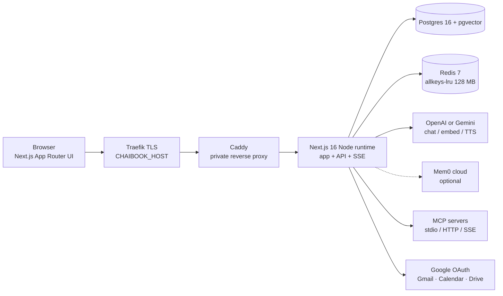

Locally, `docker compose` publishes Postgres on **5433** and Redis on **6379**. In production the stack is unpublished; only Traefik binds 80/443.

---

## 2. Component HLD

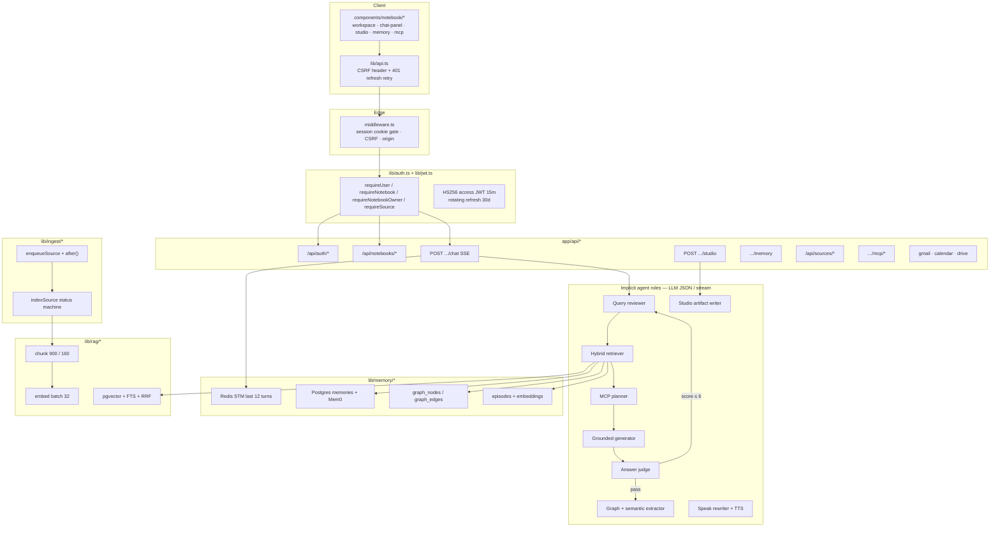

### Runtime fact about Shirube

`shirube/` lives in the same monorepo and defines `Agent`, `AgentBuilder`, `runAgent()`, `ModelRouter`, and MCP adapters. **ChaiBook LM does not import it.** Chat is a hand-rolled loop in `app/api/notebooks/[id]/chat/route.ts`. MCP uses `@modelcontextprotocol/sdk` directly. Treat Shirube as a sibling product, not a runtime dependency.

---

## 3. SDKs and LLM surface

| SDK / client | Where | What it does |
| --- | --- | --- |
| `openai` (`OpenAI`) | `lib/llm/client.ts` | Single client for chat, embeddings, and TTS. Gemini is the same SDK pointed at `https://generativelanguage.googleapis.com/v1beta/openai/`. |
| `@modelcontextprotocol/sdk` | `lib/mcp/client.ts` | Connect, `listTools`, `callTool` over stdio, Streamable HTTP, or SSE fallback. |
| `mem0ai` (`MemoryClient`) | `lib/memory/mem0.ts` | Optional cloud add/search/deleteAll. Local `memories` table is always source of truth. |
| `drizzle-orm` + `postgres` | `lib/db/index.ts` | Lazy pooled client (`max: 8`). `ensureSchema()` runs auto-DDL (`SCHEMA_VERSION = 11`). |
| `redis` | `lib/redis.ts` | STM, LTM prompt cache, rate limits. Fail-open if Redis is down. |
| `jose` | `lib/jwt.ts` | HS256 access tokens, issuer/audience `chaibook-lm`, 15-minute TTL. |
| `unpdf` / `cheerio` | ingest PDF / website | Extraction only. |
| Browser `fetch` | `lib/api.ts`, `chat-panel.tsx` | REST + SSE. Chat does **not** use `lib/api.ts` so the stream is not JSON-parsed. |

### Provider resolution (`getLlm`)

1. If `OPENAI_API_KEY` → `kind=openai`, chat `gpt-4o-mini`, embed `text-embedding-3-small` (1536 dims), TTS on.
2. Else if `GEMINI_API_KEY` or `GOOGLE_GENERATIVE_AI_API_KEY` → OpenAI-compatible Gemini, chat `gemini-2.0-flash`, embed `text-embedding-004` (768 dims, padded/truncated to 1536), TTS off.
3. Else throw. Routes check `hasLlmKey()` first.

### LLM call catalog

| Call | Helper | Used by | Stream? | Temp |
| --- | --- | --- | --- | --- |
| Query rewrite | `chatJson` | `reviewQuery` | no | 0.2 |
| Hybrid retrieve embed | `embeddings.create` | `embedQuery` / `retrieve` | no | — |
| Memory / episode embed | `embeddings.create` | `searchMemories`, `relevantEpisodes`, `writeMemory`, `rememberTurn` | no | — |
| Ingest embed (batches of 32) | `embeddings.create` | `indexSource` | no | — |
| MCP tool plan (≤ 3 calls) | `chatJson` | `gatherMcpContext` | no | 0.2 |
| Grounded answer | `chat.completions.create` stream | chat route | **yes** | 0.15 then 0.25 on retry |
| Answer judge | `chatJson` | `judgeAnswer` | no | 0.2 |
| Graph + semantic extract | `chatJson` | `rememberTurn` (after response) | no | 0.2 |
| Studio podcast / FAQ / cards / guide / roadmap | `chatJson` | studio route | no | 0.2 |
| Podcast / speak TTS | `audio.speech.create` (`tts-1`) | `synthesizeSegment` | no | — |
| Speak rewrite | `chatText` | speak route | no | 0.4 |

`chatJson` wraps `chatText` and strips markdown fences. Judge failure **fails open** (score 7, “Judge unavailable”). Query-review failure falls back to the raw question.

---

## 4. Implicit agents (roles, not Shirube classes)

ChaiBook runs specialized prompts as sequential roles. None of them share a Shirube `Session` or tool registry.

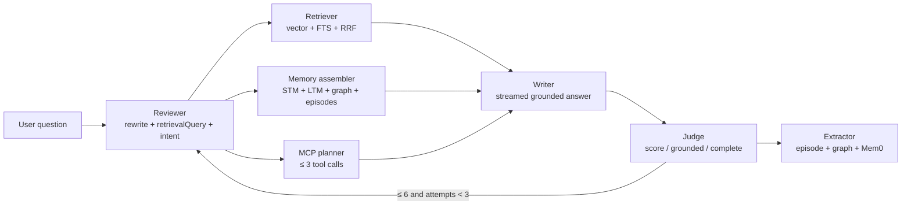

| Role | File | Inputs | Outputs | Side effects |
| --- | --- | --- | --- | --- |
| Input guard | `lib/rag/guardrails.ts` | raw string | `{ok, question}` or 400 | none |
| Query reviewer | `lib/rag/query-review.ts` | question, notebook title, optional judge feedback | `rewritten`, `retrievalQuery`, `intent` | 1 LLM JSON call |
| Retriever | `lib/rag/retrieve.ts` | notebook id, retrieval query, k=8 | `RetrievalHit[]` | embed + 2 SQL searches |
| Memory assembler | `lib/memory/context.ts` | notebook id, query | prompt block | Redis + Postgres + optional Mem0 |
| MCP planner + executor | `lib/mcp/context.ts` | notebook id, query | tool text + `used[]` | 1 LLM JSON + ≤ 3 MCP calls |
| Writer | chat route | system + last 9 history msgs + user prompt | token stream | SSE `delta` |
| Judge | `lib/rag/judge.ts` | Q, A, hits, MCP text | score 1–10, rephrase | 1 LLM JSON |
| Extractor | `lib/memory/graph.ts` `rememberTurn` | Q, A, source ids | episode row, graph upserts, semantic facts | embed + LLM JSON + DB + Mem0 |
| Studio writer | studio route | first 40 chunks | artifact JSON (+ TTS) | `artifacts` insert |
| Speaker | speak route | last answer | spoken script + mp3 | TTS |

---

## 5. Data model

Every notebook-scoped table is keyed by `notebook_id`. Vectors are `vector(1536)`.

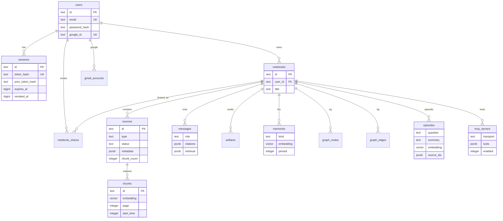

### Source status machine

`uploading` → `extracting` → `indexing` → `ready` | `error`

Progress lives in `sources.metadata.progress` (15 during extract, 15–95 while embedding in batches of 40, 100 when ready).

### Source types

`pdf` · `text` · `website` · `youtube` · `transcript` · `email` · `calendar` · `drive` · `mcp`

---

## 6. Caching and Redis

Redis is optional at the process level: every caller treats a missing/down client as empty. Production compose sets `--maxmemory 128mb --maxmemory-policy allkeys-lru`.

| Key | Purpose | TTL / eviction | Writers | Readers |
| --- | --- | --- | --- | --- |
| `cb:stm:{notebookId}` | List of last 12 `{q,a,at}` turns | `EXPIRE` 2 h on every touch | `pushShortTerm` after chat | `readShortTerm` during chat |
| `cb:stm:lru` | ZSET of notebook ids by last-touch | Trim to 2 000 coldest | `touch` / `evictColdNotebooks` | eviction only |
| `cb:ltm:{notebookId}:{sha1(q)[:12]}` | Assembled long-term prompt block | 60 s | `cachedLongTerm` | same, on cache hit skips Mem0 + graph + episode SQL |
| `cb:ltm:{notebookId}:*` | busted as a set | deleted | `bustMemoryCache` after persist / clear chat | — |
| `cb:rl:{bucket}` | Fixed-window counter (`INCR` + `EXPIRE` on first hit) | window seconds | `hitLimit` | `peekLimit` (login lock) |

### Rate-limit buckets

| Bucket | Limit | Window | Fail mode |
| --- | --- | --- | --- |
| `chat:{userId\|ip}` | 25 | 60 s | 429 |
| `studio:{userId\|ip}` | 12 | 60 s | 429 |
| `api:{userId}` | 180 | 60 s | 429 from `requireUser` |
| `login:{ip}` | 10 | 60 s | 429 |
| `login-fail:{email}` | 8 | 15 min | 429 (`peekLimit` then `hitLimit` on failure) |
| `register:{ip}` | 8 | 60 s | 429 |

If Redis is down, `hitLimit` returns `{ ok: true }` — the API stays up, STM and limits degrade.

### Other caches (not Redis)

- **Module singletons:** Postgres pool, Drizzle, Redis client, Mem0 client, schema-ready promise (`globalThis`).
- **Access JWT:** 15-minute in-cookie cache of identity; DB is hit only to confirm the session row is not revoked.
- **MCP tool catalog:** persisted on `mcp_servers.tools`; chat skips `listTools` when the array is already populated.
- **`lib/rag/bm25.ts`:** in-process BM25 helper. Live retrieval uses Postgres `ts_rank` / `websearch_to_tsquery`, not this file.

---

## 7. Request gate (every mutating API)

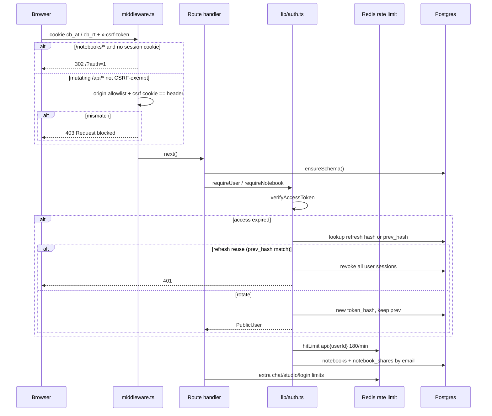

Cookies (`lib/auth-cookies.ts`):

- `cb_at` — httpOnly access JWT, 15 min
- `cb_rt` — httpOnly refresh (raw 32-byte token; only SHA-256 hash is stored), 30 days, absolute session 90 days
- `cb_csrf` — readable cookie for double-submit CSRF
- `chaibook_session` — legacy row id, migrated on next `getSessionUser`
- `chaibook_oauth` — 10-minute Google state CSRF

CSRF-exempt: login, register, logout, refresh, Google login start, Gmail OAuth callback.

Client `lib/api.ts` attaches the CSRF header and, on 401, POSTs `/api/auth/refresh` once then retries.

---

## 8. Loop 1 — Chat (the main agent loop)

**Entry:** `POST /api/notebooks/[id]/chat`  
**Transport:** `text/event-stream`  
**Budget:** `maxDuration = 180`

### Preconditions (DB / cache)

1. `ensureSchema()`
2. `requireNotebook(id)` → user + notebook + role
3. `limitOrResponse(chat:{userId}, 25, 60)`
4. `hasLlmKey()`
5. `screenInput(question)` — length 2–4000, reject jailbreak / prompt-exfil regex
6. Parallel: `SELECT sources`, `SELECT mcp_servers.enabled` — need at least one `ready` source **or** one enabled MCP
7. `INSERT messages` user row
8. `SELECT messages` for the notebook, last 10 as chat history

### Inner retry loop (`attempts = 1..MAX_ATTEMPTS` where `MAX_ATTEMPTS = 3`, `PASS_SCORE = 6`)

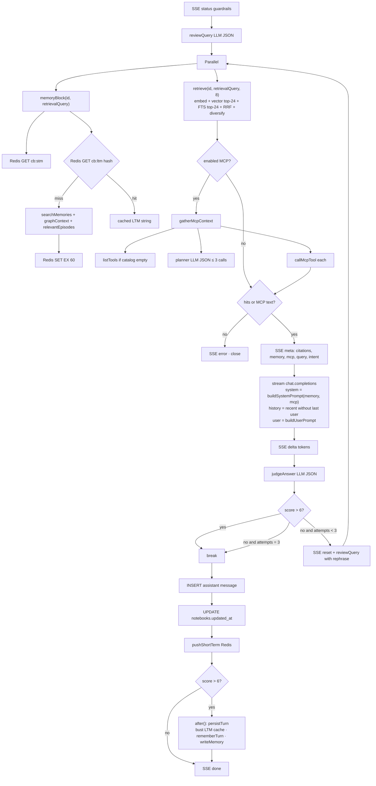

### Memory block assembly

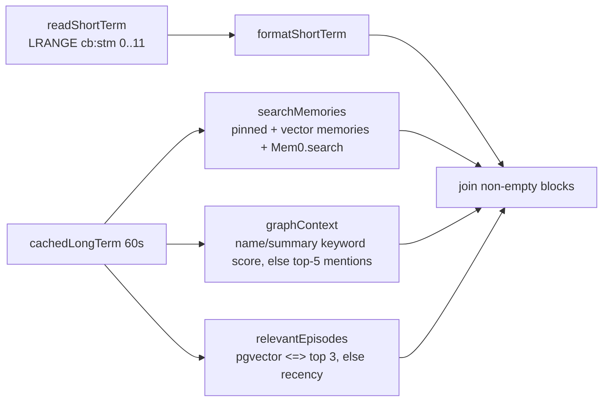

`persistTurn` (only if the judge passed, and only in `after()` so the SSE `done` is not blocked):

1. `bustMemoryCache(notebookId)` — `KEYS cb:ltm:{id}:*` + `DEL`
2. `rememberTurn` — insert `episodes` (embed `question + summary`), then LLM-extract ≤ 8 nodes / 10 edges / 4 semantic facts; upsert `graph_nodes` by `(notebookId, name, type)` incrementing `mentions`; insert missing `RELATED_TO` / `MENTIONS` / `ABOUT` edges
3. Each semantic fact → `writeMemory` (local row + embed + optional `mem0.add`)

Failed generations still persist the assistant row and STM. They do **not** write episodes or the graph.

### SSE event types (consumed by `chat-panel.tsx`)

| `type` | Meaning |
| --- | --- |
| `status` | Human stage: guardrails, query_review, retrieve, mcp, generate, judge, retry |
| `meta` | citations, retrieval inspector scores, memory text, MCP tool names, rewritten query |
| `delta` | token |
| `reset` | wipe the in-progress assistant bubble (retry) |
| `score` | judge numbers + `pass` |
| `done` | final mapped message, `stored`, `attempts` |
| `error` | abort |

---

## 9. Loop 2 — Ingest / index

**Entry points** all call `enqueueSource` then `after(() => indexSource(id))`:

- `POST /api/notebooks/[id]/sources` — upload / URL / text / playlist
- `POST /api/sources/[id]` and `POST /api/sources/[id]/reindex`
- `POST /api/notebooks/[id]/gmail|calendar|drive`
- `POST /api/notebooks/[id]/mcp/[mcpId]/pull`

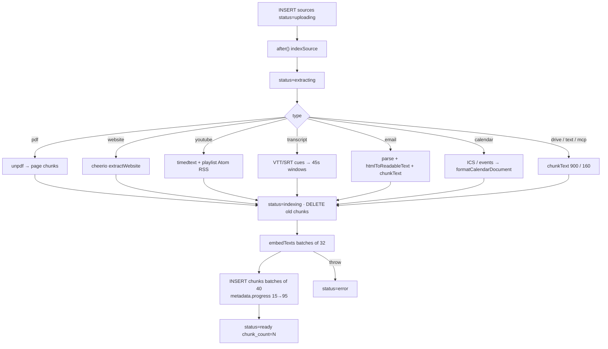

YouTube playlists: `extractPlaylist` then one `enqueueSource` per video (cap of 12 public videos in the YouTube extractor). Files larger than 12 MB are rejected at the sources POST.

Chunking (`lib/rag/chunk.ts`): recursive split on `\n\n`, `\n`, sentence, then pack to **900** chars with **160** overlap. Timed transcripts group cues into **45 s** windows.

Embeddings are L2-normalized and forced to 1536 dimensions (`toVector`) so Gemini 768-d vectors still fit `vector(1536)`.

---

## 10. Loop 3 — MCP connect / plan / pull

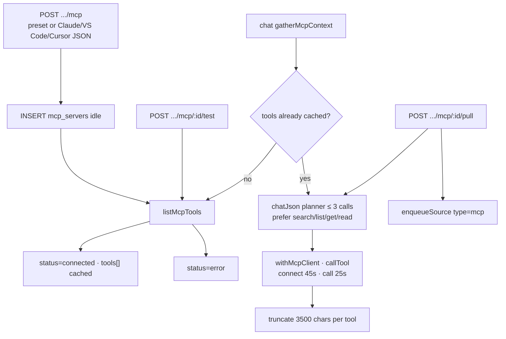

Transports (`lib/mcp/client.ts`):

- `stdio` — `StdioClientTransport` (`npx -y @modelcontextprotocol/server-github`, Jira, Postgres, Slack, custom). Postgres URI appended from `env.POSTGRES_CONNECTION_STRING`.
- `http` — Streamable HTTP, then SSE fallback. Auth headers from `HEADER_AUTHORIZATION`, `NOTION_TOKEN`, or `GITHUB_PERSONAL_ACCESS_TOKEN`.

Presets: GitHub, Jira, Postgres, Notion (HTTP), Slack, custom.

The planner prompt forbids write/delete/create tools unless the user clearly asks to change something. Failed tool calls are skipped; the writer still answers from notebook excerpts.

---

## 11. Loop 4 — Auth

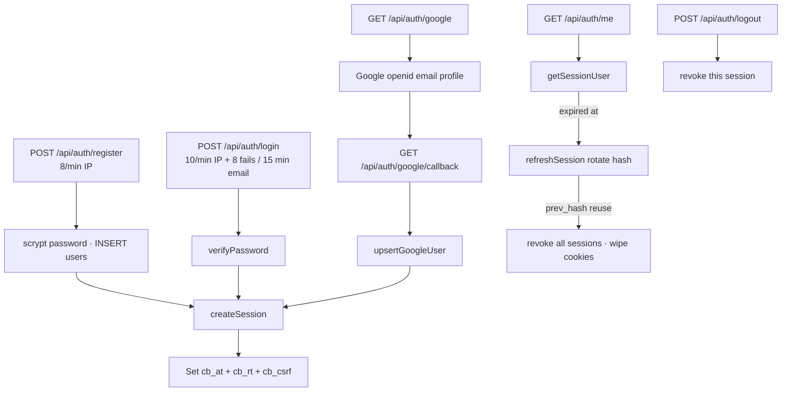

Google **workspace** (Gmail / Calendar / Drive) is a second OAuth with read scopes. Tokens live in `gmail_accounts` (one row per user). Login OAuth is identity-only (`openid email profile`). Connect URL: `GET /api/gmail/connect?notebookId=&kind=`.

---

## 12. Loop 5 — Studio, speak, suggestions

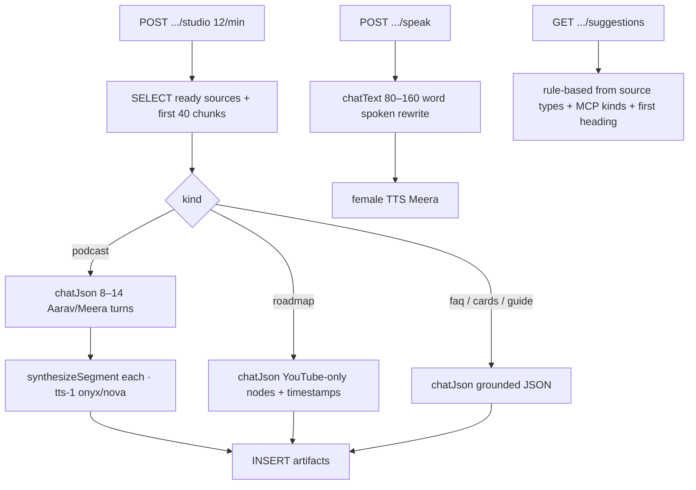

Speak never invents facts; it only rewrites the written answer and strips `[n]` citations. Gemini has no TTS — the client falls back to browser voices when `audioBase64` is missing.

Suggestions do **not** call the LLM.

---

## 13. Loop 6 — Forget / isolation

`lib/memory/forget.ts` is the only place that tears down vectors and memory together.

| Trigger | Function | Deletes | Keeps |
| --- | --- | --- | --- |
| Delete one source | `forgetSource` | chunks of that source; unpinned memories/episodes/graph nodes tagged with `sourceIds` or title | pins; multi-source graph nodes (source id stripped) |
| Delete all sources | `forgetAllSources` + `sweepEmptyNotebook` | leftover unpinned memory, episodes, graph, artifacts | pins |
| Clear chat | `forgetChat` | messages, episodes, unpinned semantic/episodic memory, graph, artifacts, Redis STM | pins |
| Delete notebook | `forgetNotebook` | everything above + Mem0 `deleteAll({ userId: notebookId })` + notebook row | — |

---

## 14. Hybrid retrieval (DB calls)

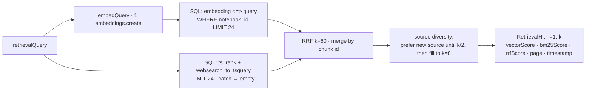

`SELECT sources` for the notebook builds the title/type/url/`videoId` map used by citation chips.

---

## 15. API catalog

Auth columns: **U** = signed-in, **N** = notebook member, **O** = owner, **S** = source in an accessible notebook. Every `N`/`O`/`S` route also hits `ensureSchema` + `require*`.

### Auth and health

| Method | Path | Auth | DB | Cache | LLM / ext |
| --- | --- | --- | --- | --- | --- |
| POST | `/api/auth/register` | — | insert `users`, `sessions` | RL register | — |
| POST | `/api/auth/login` | — | select user | RL login + fail | — |
| GET | `/api/auth/google` | — | — | oauth cookie | Google authorize |
| GET | `/api/auth/google/callback` | — | upsert user, insert session | cookies | Google token + userinfo |
| POST | `/api/auth/refresh` | cookie | rotate session hashes | cookies | — |
| POST | `/api/auth/logout` | cookie | revoke session | clear cookies | — |
| GET | `/api/auth/me` | cookie | session + user | — | — |
| GET | `/api/health` | — | `select 1` | Redis PING | key presence only |

### Notebooks, share, chat

| Method | Path | Auth | DB | Cache | LLM / ext |
| --- | --- | --- | --- | --- | --- |
| GET | `/api/notebooks` | U | owned + shared + source counts | RL api | — |
| POST | `/api/notebooks` | U | insert notebook | — | — |
| GET | `/api/notebooks/:id` | N | sources + mcp enabled | — | — |
| PATCH | `/api/notebooks/:id` | O | update title/emoji | — | — |
| DELETE | `/api/notebooks/:id` | O | `forgetNotebook` | STM + Mem0 | Mem0 deleteAll |
| GET/POST | `/api/notebooks/:id/share` | N / O | shares + optional mail | — | SMTP |
| DELETE | `/api/notebooks/:id/share/:shareId` | O | delete share | — | — |
| GET | `/api/notebooks/:id/share/suggest?q=` | O | `ilike` users, exclude taken | — | — |
| GET/DELETE | `/api/notebooks/:id/messages` | N / O | list or `forgetChat` | STM on delete | — |
| POST | `/api/notebooks/:id/chat` | N | messages + sources + mcp + after persist | STM + LTM + RL chat | reviewer, embed, MCP, stream, judge, extract |
| GET/POST | `/api/notebooks/:id/studio` | N | chunks + insert artifact | RL studio | `chatJson` + TTS |
| POST | `/api/notebooks/:id/speak` | N | — | — | `chatText` + TTS |
| GET | `/api/notebooks/:id/suggestions` | N | sources, mcp, chunks | — | none |
| GET/POST | `/api/notebooks/:id/export` | N | messages | — | SMTP on POST |
| GET/POST/PATCH/DELETE | `/api/notebooks/:id/memory` | N | memories, graph, episodes | — | embed + Mem0 on write |

### Sources and Google workspace

| Method | Path | Auth | DB | Cache | LLM / ext |
| --- | --- | --- | --- | --- | --- |
| GET/POST/DELETE | `/api/notebooks/:id/sources` | N | list / enqueue / `forgetAllSources` | — | YouTube playlist fetch; `after` embed |
| GET/POST/DELETE | `/api/sources/:id` | S | get / reindex / forget+delete | — | `after` embed |
| POST | `/api/sources/:id/reindex` | S | status uploading | — | `after` embed |
| GET | `/api/sources/:id/chunks` | S | chunks | — | — |
| GET | `/api/sources/:id/file` | S | file_data | — | — |
| GET | `/api/gmail/connect` | N | — | — | Google workspace authorize |
| GET | `/api/gmail/callback` | — | upsert `gmail_accounts` | — | token exchange |
| GET | `/api/gmail` · `/api/gmail/status` | U | account row | — | — |
| POST | `/api/notebooks/:id/gmail` | N | enqueue emails | — | Gmail API |
| GET/POST | `/api/notebooks/:id/calendar` | N | enqueue ICS-like source | — | Calendar API |
| GET/POST | `/api/notebooks/:id/drive` | N | enqueue files | — | Drive API |

### MCP

| Method | Path | Auth | DB | LLM / MCP |
| --- | --- | --- | --- | --- |
| GET/POST | `/api/notebooks/:id/mcp` | N / O | list / `createMcpServer` | probe `listTools` |
| PATCH/DELETE | `/api/notebooks/:id/mcp/:mcpId` | O | update / delete | — |
| POST | `.../mcp/:mcpId/test` | N | update tools/status | `listTools` |
| POST | `.../mcp/:mcpId/pull` | N | `gatherMcpContext` + `enqueueSource` | planner + tools + embed after |

---

## 16. Client flows

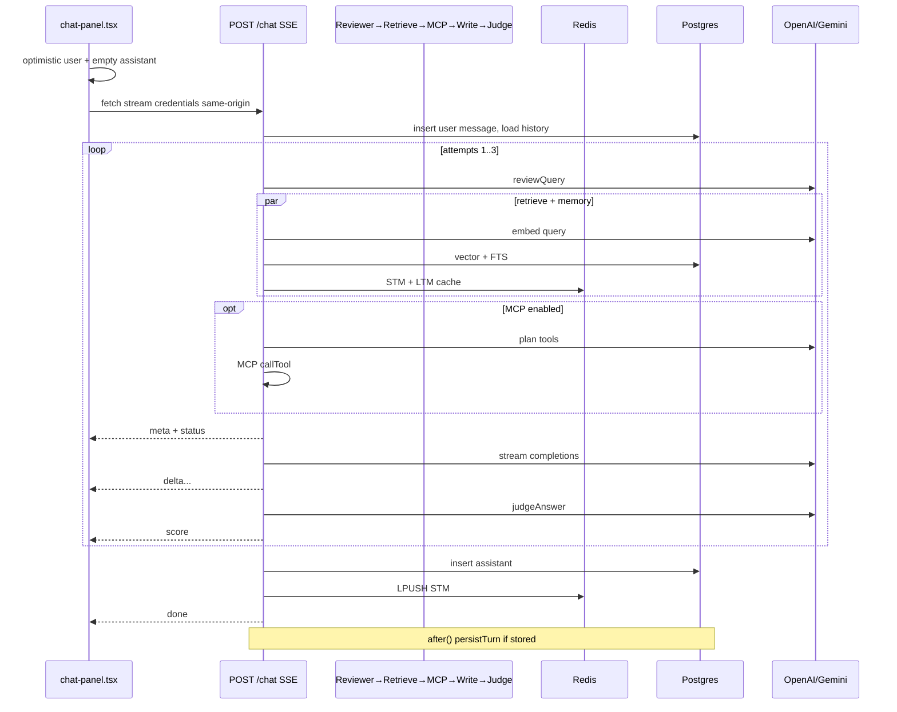

Workspace load (typical): `GET /notebooks/:id` page → `GET /api/notebooks/:id` + sources + messages + studio + memory + mcp + suggestions + gmail status, all via `api()`.

---

## 17. Deployment topology

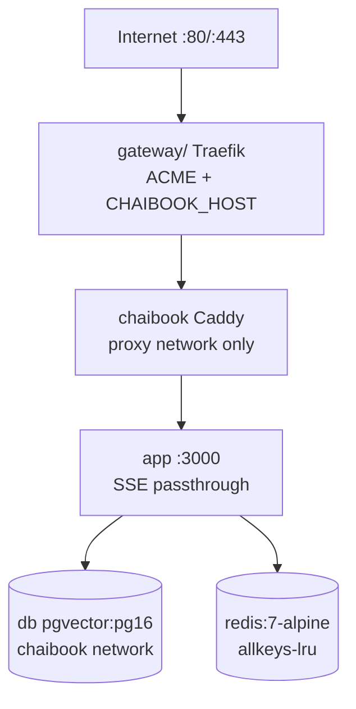

`docker-compose.prod.yml` keeps app/db/redis off the public network. `./deploy.sh` builds and restarts that stack after `../setup.sh` has Traefik up.

---

## 18. Failure and isolation rules

- **Notebook isolation:** every retrieve / memory / graph / episode query filters `notebook_id`. Shares are email-level (`notebook_shares`), not public links.
- **Redis down:** STM empty, LTM rebuilt every turn, rate limits fail open.
- **Mem0 down:** local `memories` still work; remote search/add is swallowed.
- **Judge down:** draft accepted at score 7 (so `persistTurn` still runs).
- **MCP tool fail:** skipped; writer uses excerpts + memory.
- **FTS SQL fail:** vector-only RRF.
- **Gemini vs OpenAI:** same chat/embed code path; TTS and podcast audio are OpenAI-only.
- **Indexing errors:** source stays `error` with `sources.error`; other sources in the notebook are untouched.

---

## 19. File map

```
app/api/                 REST + SSE routes listed in §15
lib/auth.ts              session, gates, password, Google user
lib/jwt.ts               access token
lib/csrf.ts              origin + header match
lib/rate-limit.ts        Redis fixed windows
lib/db/schema.ts         Drizzle tables
lib/db/index.ts          pool + ensureSchema DDL
lib/ingest/pipeline.ts   extract → chunk → embed → store
lib/ingest/create.ts     enqueue + after()
lib/rag/                 chunk, embed, retrieve, prompt, judge, review, guardrails
lib/memory/              stm, mem0, graph, context, forget
lib/mcp/                 client, planner context, presets, JSON import
lib/llm/                 OpenAI/Gemini client + TTS
lib/redis.ts             singleton client
components/notebook/     UI that drives the loops
```

This document is the internal HLD. Implementation source of truth is the files above; if a loop changes, update the matching section here.
